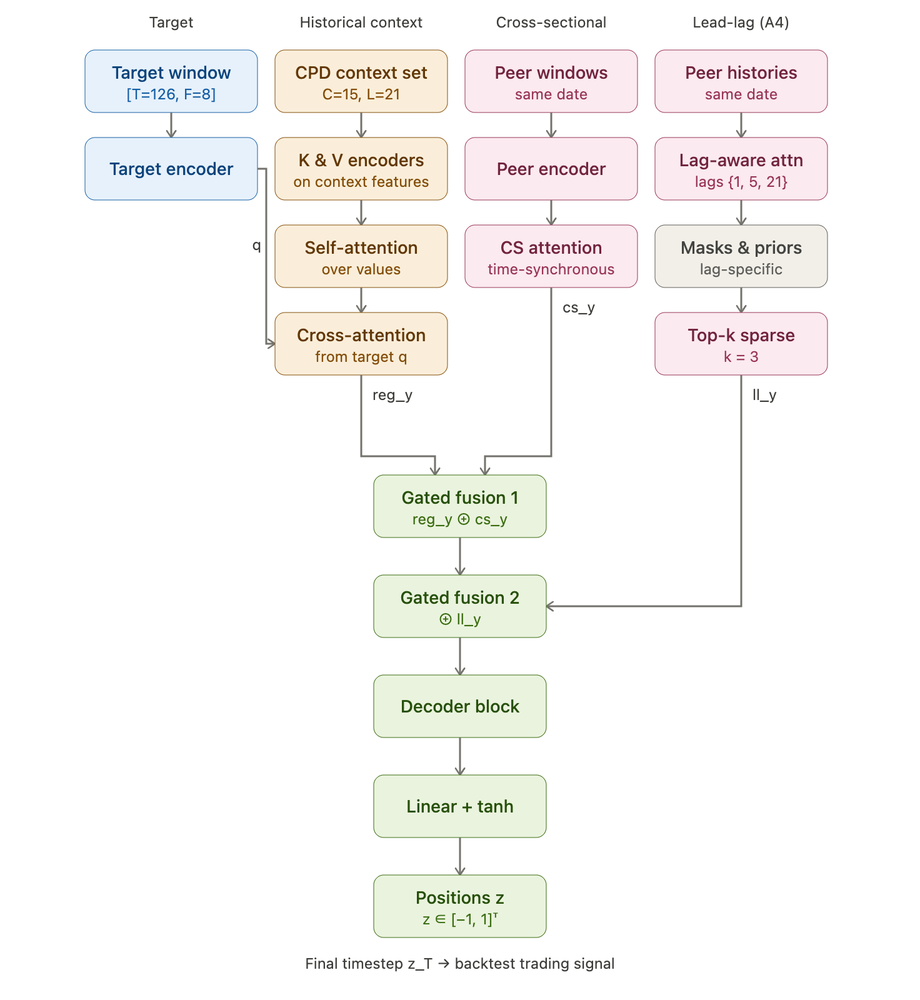
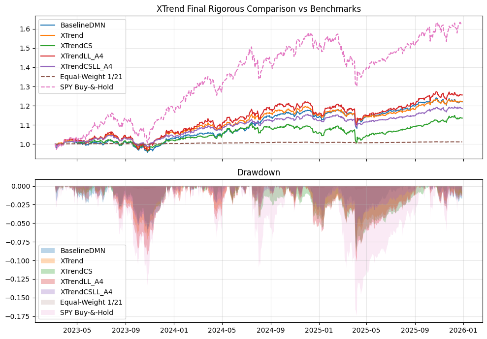
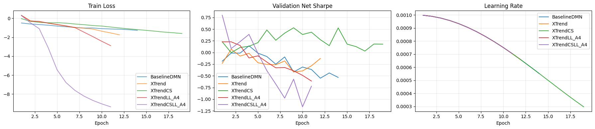

# Peer-Aware Extension to Momentum Strategy

> Re-implementing the X-Trend architecture (Wood et al., 2024) and extending
> it with cross-sectional and causal lead-lag peer mechanisms for index-level
> ETF trend-following.
>
> 11-785 Introduction to Deep Learning · Spring 2026 Final Project
> Bill Liu · Owen Zhang · Carnegie Mellon University

---

## 1. Project objective

Trend-following deep momentum networks degrade during regime shifts because
the patterns they learn in one market environment do not generalize cleanly to
another. **X-Trend** (Wood et al., 2024) addresses this with a few-shot,
regime-aware mechanism that conditions each prediction on a context set of
historical regimes. Two directions identified in that paper as promising but
unexplored are (i) learnable cross-sectional attention across assets and
(ii) lead-lag spillovers between assets.

This project pursues both. We:

1. **Re-implement** the X-Trend architecture from scratch.
2. **Re-apply** it to a 21-ETF index-level universe and compare against a Deep
   Momentum Network baseline.
3. **Extend** X-Trend with a time-synchronous cross-sectional peer branch and
   a causal lead-lag peer branch with Bennett-style priors, lag-specific
   ranking masks, and sparse top-k selection — combined through
   zero-initialized gated residual fusion so training begins as plain X-Trend
   and only adopts peer information if it improves the objective.

The training and evaluation objective is annualized **net Sharpe** (after a
5 bps proportional transaction cost), so the model is optimized directly
against the metric used to compare strategies.

## 2. Model family

Five models of increasing structural complexity are implemented and compared
on the same chronological split, cost assumption, and metrics:

| Model | Historical Contexts | CS branch | LL branch | Description |
|---|:---:|:---:|:---:|---|
| **BaselineDMN** | – | – | – | Single-asset DMN (VSN + LSTM + residual FFN), uses only the target ETF's own history. |
| **XTrend** | ✓ | – | – | Few-shot regime-aware backbone: query/key/value temporal encoders, self-attention over context values, target-to-context cross-attention. |
| **XTrendCS** | ✓ | ✓ | – | XTrend + time-synchronous cross-sectional peer attention, fused via zero-init gated residual. |
| **XTrendLL-A4** | ✓ | – | ✓ | XTrend + causal lag-aware peer attention with Bennett prior, lag-specific ranking mask, delta-valued peers, top-k=3 over lags {1, 5, 21}. |
| **XTrendCSLL-A4** | ✓ | ✓ | ✓ | Full model: regime-aware backbone + cross-sectional peers + causal lead-lag peers. |

**Architecture (final model, XTrendCSLL-A4):**



## 3. Dataset universe and split

- **Universe:** 21 index-level ETFs from Yahoo Finance, spanning broad
  equities, sector equities, fixed income & credit, real estate, commodities,
  and FX.

| Asset class | ETFs | Count |
|---|---|:---:|
| US & Int'l Equity | SPY, QQQ, IWM, VTI, EFA, EEM | 6 |
| US Sector Equity | XLF, XLE, XLK, XLI, XLP, XLV | 6 |
| Fixed Income & Credit | TLT, IEF, SHY, LQD, HYG | 5 |
| Real Estate / Commodities / FX | VNQ, GLD, DBC, UUP | 4 |

- **Frequency:** daily, 2005–2025 (aligned panel starts after the latest ETF
  inception + feature warmup).
- **Chronological split:** 3297 train / 707 validation / 707 test trading days.
- **Inputs (per asset, daily):** five volatility-scaled returns at horizons
  {1, 21, 63, 126, 252} and three normalized MACD signals over pairs
  {(8, 24), (16, 28), (32, 96)} → 8 features per day.
- **Target:** next-day volatility-scaled return (15% target vol).
- **Episode shape:** 126-day target window, 15 historical CPD-derived context
  regimes of length 21, and same-date peer windows (peer-aware models).

## 4. Final rigorous results

Test-period metrics, computed net of 5 bps proportional transaction costs.
Best learned model is **XTrendCSLL-A4**.

| Model | Net Sharpe | Net MaxDD | Net Calmar | Net Ann. Return | Avg. Turnover |
|---|---:|---:|---:|---:|---:|
| BaselineDMN | 1.0768 | -0.0830 | 0.8867 | 0.0736 | 0.1421 |
| XTrend | 1.1605 | -0.0729 | 1.0117 | 0.0737 | 0.0014 |
| XTrendCS | 0.7504 | -0.0890 | 0.5196 | 0.0462 | 0.0485 |
| XTrendLL-A4 | 0.9555 | -0.1018 | 0.8308 | 0.0846 | 0.0014 |
| **XTrendCSLL-A4** | **1.2304** | **-0.0584** | **1.0670** | 0.0623 | 0.0021 |
| Equal-Weight 1/21 | 0.9555 | -0.0050 | 0.8117 | 0.0041 | 0.0001 |
| SPY Buy-and-Hold | 1.2105 | -0.1746 | 1.0802 | 0.1886 | 0.0014 |

**Cumulative performance & drawdown (test period):**



**Training diagnostics — train loss, validation net Sharpe, LR schedule:**



**Takeaways**

- The tuned X-Trend backbone (`H=96`, `C=15`) is already a strong ETF
  benchmark — net Sharpe 1.16 with turnover only 0.0014.
- Pure cross-sectional peer information (XTrendCS) is noisy on its own and
  hurts Sharpe.
- Lead-lag alone (XTrendLL-A4) does not surpass plain XTrend.
- Combined causal cross-sectional + lead-lag peers (XTrendCSLL-A4) reach the
  highest net Sharpe (1.2304) and the best max drawdown (-5.84%) among the
  learned models, beating Equal-Weight 1/21 in risk-adjusted terms and
  exceeding SPY net Sharpe with substantially lower drawdown.
- In a low signal-to-noise setting, careful architectural constraints
  (causal lags, sparse top-k, lag-specific priors, zero-init fusion) matter
  at least as much as raw model size — H=96 generalized better than H=128.

## 5. Install

```bash
# clone
git clone https://github.com/billliu-cmd/S11685_Final_Project.git
cd S11685_Final_Project

# (recommended) fresh environment
python -m venv .venv && source .venv/bin/activate

# core dependencies
pip install -r requirements.txt

# PyTorch is intentionally NOT pinned in requirements.txt — install the wheel
# that matches your runtime (CPU / local CUDA / Colab GPU). For example:
pip install torch          # CPU
# or follow https://pytorch.org/get-started/locally/ for CUDA wheels
```

## 6. How to reproduce


## 7. Repo layout

```
S11685_Final_Project/
├── README.md
├── requirements.txt
├── __init__.py
│
├── config.py                 # Hyperparameters, feature spec, default ETF list
│
├── data.py                   # Yahoo download + feature/target construction
├── data2.py                  # Episode/peer window assembly for X-Trend variants
├── cpd.py                    # Change-point detection for regime segmentation
├── jump_model.py             # Jump-model regime helper used by CPD
│
├── components.py             # Shared blocks: TemporalBlock, VSN, Self/CrossAttention,
│                             #   DecoderBlock, CrossSectionBlock, gated residual fusion
├── lag_blocks.py             # LagAwarePeerBlock (causal LL attention, top-k, masks)
├── lead_lag_ranking.py       # Bennett-style lag-specific strength scores S_{τ,j,i}
│
├── Baseline.py               # BaselineDMN model
├── x_trend.py                # XTrend backbone (regime-aware few-shot)
├── x_trend_cross_section.py  # XTrendCS / XTrendLL-A4 / XTrendCSLL-A4
│
├── train.py                  # Sharpe loss with cost penalty, training loop,
│                             #   metric helpers, early stopping
├── backtest.py               # Equity curves, drawdown, Calmar, turnover, plots
│
├── figures/                  # Figures referenced from this README
│   ├── architecture.png
│   ├── results.png
│   └── training_curves.png
│
├── Baselin_training_hidden_64.ipynb     # H=64 baseline ablation
├── Baseline_training_hidden_128.ipynb   # H=128 baseline ablation
└── data_format_comparison.ipynb         # Input format diagnostics
```

## 8. Known limitations

- **Single-seed run.** Results are reported from one training seed. A
  multi-seed robustness study (and stress periods such as 2020) is left for
  future work.
- **Small universe.** 21 ETFs is enough to demonstrate the peer-aware
  mechanism but limits how much cross-sectional structure the LL branch can
  exploit. Scaling up will likely require a pre-selection layer (liquidity,
  asset class, sector, similarity) before peer attention.
- **Yahoo Finance data.** The pipeline pulls live from Yahoo, so adjusted
  prices and inception dates can shift slightly between reruns. The fixed
  3297 / 707 / 707 chronological split mitigates this but does not eliminate
  it.
- **Static lead-lag priors.** Bennett strength scores `S_{τ,j,i}` are
  estimated once on the training set. A dynamic / online lead-lag scoring
  scheme would likely help in non-stationary regimes.
- **CPD-only retrieval.** Historical contexts are sampled from a CPD-derived
  pool with no learned target-context similarity score. A learned retrieval
  filter is a natural next step.
- **Price-only features.** No macro, term-structure, or realized-vol inputs;
  enriching the feature set could further improve both the regime branch and
  the peer branches.
- **5 bps cost assumption.** Realistic for liquid ETFs but should be
  stress-tested at higher cost levels before any deployment claim.
- **PyTorch unpinned.** Intentional, since the right wheel depends on the
  runtime; reproducibility on a specific GPU/CPU stack requires the user to
  pin their own torch version.

## References

1. Wood, K., Kessler, S., Roberts, S. J., & Zohren, S. (2024). *Few-Shot
   Learning Patterns in Financial Time-Series for Trend-Following Strategies.*
   arXiv:2310.10500.
2. Lim, B., Zohren, S., & Roberts, S. (2019). *Enhancing Time-Series Momentum
   Strategies Using Deep Neural Networks.* JFDS, 1(4).
3. Poh, D., Lim, B., Zohren, S., & Roberts, S. (2021). *Enhancing
   Cross-Sectional Currency Strategies by Context-Aware Learning to Rank with
   Self-Attention.* arXiv:2105.10019.
4. Bennett, S., Cucuringu, M., & Reinert, G. (2022). *Lead-Lag Detection and
   Network Clustering for Multivariate Time Series.* arXiv:2201.08283.
5. Zhou, W., Wang, S., Cucuringu, M., et al. (2025). *DeltaLag: Learning
   Dynamic Lead-Lag Patterns in Financial Markets.* arXiv:2511.00390.
6. Moskowitz, T. J., Ooi, Y. H., & Pedersen, L. H. (2012). *Time Series
   Momentum.* Journal of Financial Economics, 104(2), 228–250.
